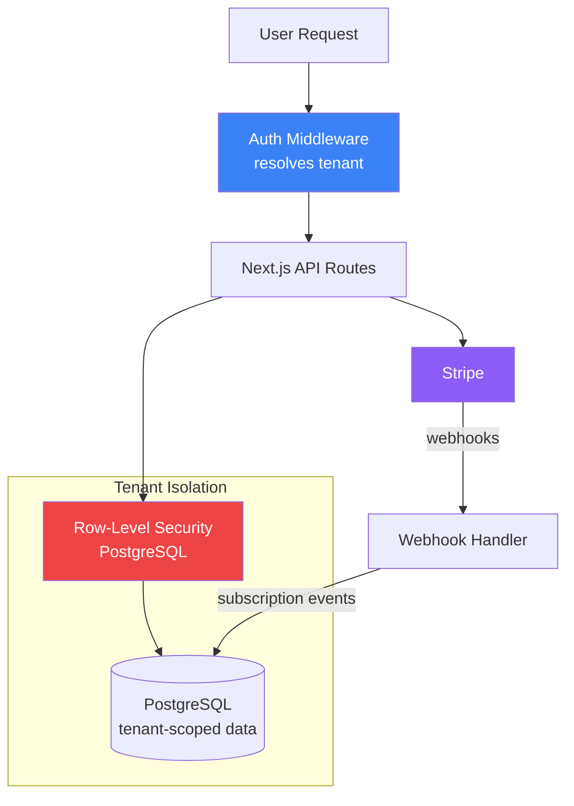

# Multi-Tenant SaaS with Billing

A production-ready SaaS boilerplate with full multi-tenancy, Stripe subscription billing, role-based access control, and tenant isolation — the foundational architecture used by real SaaS products.

## Architecture



## Multi-Tenancy Model

Each request is scoped to a tenant via subdomain or JWT claim. PostgreSQL Row-Level Security enforces that tenants can never read each other's data — even if application code has a bug:

```sql
CREATE POLICY tenant_isolation ON documents
  USING (tenant_id = current_setting('app.tenant_id')::uuid);

SET LOCAL app.tenant_id = 'tenant-uuid-here';
```

## Billing Flow

```
User signs up → free tier activated
     ↓
Upgrades plan → Stripe Checkout session
     ↓
Payment succeeds → stripe webhook → subscription updated in DB
     ↓
Feature flags check subscription tier on every request
     ↓
Cancels → grace period → downgrade to free
```

## Tech Stack

| Layer | Technology |
|-------|-----------|
| Frontend | Next.js 14 (App Router) |
| Auth | NextAuth.js / Clerk |
| Database | PostgreSQL + Prisma |
| Tenant Isolation | Row-Level Security (RLS) |
| Billing | Stripe (subscriptions + webhooks) |
| Styling | Tailwind CSS + shadcn/ui |

## Project Structure

```
multitenant-saas-billing/
├── app/
│   ├── (auth)/        # Sign in / sign up
│   ├── (dashboard)/   # Tenant-scoped app pages
│   └── api/
│       ├── stripe/    # Checkout + webhook handlers
│       └── trpc/      # Type-safe API router
├── prisma/
│   └── schema.prisma  # Multi-tenant schema with RLS policies
├── lib/
│   ├── stripe.ts
│   ├── tenant.ts      # Tenant resolution middleware
│   └── subscription.ts
└── README.md
```

## Key Features

- Tenant isolation via PostgreSQL RLS — data leakage is impossible at the DB layer
- Stripe subscriptions: free / pro / enterprise tiers
- Stripe webhooks for subscription lifecycle (created, updated, canceled)
- Role-based access: owner, admin, member per tenant
- Usage-based billing hooks (metered API calls)
- Subdomain-based tenant routing (`acme.yoursaas.com`)
